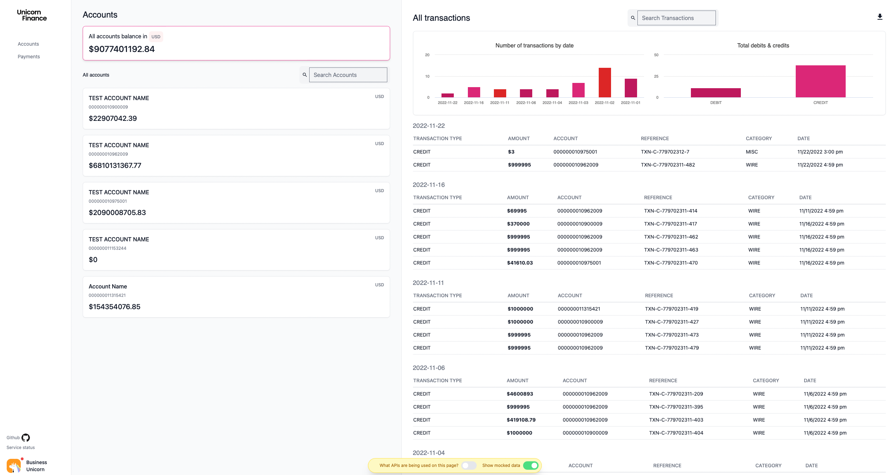

# Unicorn Finance

A sample application showcasing J.P. Morgan Payments core external APIs. It is a
clone-and-run demo: every call runs offline against a built-in mock, and the same code
hits the real J.P. Morgan sandbox once you drop in your credentials.



## The four beats

Each page takes you *behind* one API - what it does and how you call it.

| Beat | Page | API | What it shows |
|---|---|---|---|
| Reach | Payments | Global Payments 2 | Initiate a payment (RTP / ACH) across rails from one contract |
| Speed | FX | FX Rate Sheet | Pull a real-time rate sheet - lockable (guaranteed) vs indicative rates |
| Confidence | Validations | Account Validation | Verify an account before you pay it; confidence codes, not a yes/no |
| Retrieve | Accounts | Balances + Transactions | The query side - balances and the transactions you've sent/received |

## Getting started (Tier 1 - offline, no credentials)

Everything runs against an in-browser mock ([MSW](https://mswjs.io/)), so you need no
J.P. Morgan network access and no keys.

**Prerequisites:** either **Docker** (Desktop running), or **Node.js >= 20.19** with
**pnpm** (`corepack enable` sets pnpm up for you).

With Docker:

```sh
docker compose up
```

Then open http://localhost:3000.

Or run the client directly:

```sh
cd app/client
corepack enable   # first time only - enables pnpm
pnpm install
pnpm start
```

That's the whole demo - all four beats work offline. It opens on a home screen that
introduces the app and points you to the right API for what you're building.

> Port 3000 already in use? Stop the other process or run `pnpm start -- --port 3001`.

## Finding your way around

- **Environment switch** (left navbar): three tiers in graduation order - **Local Mock**
  (in-app, offline, no keys - the default), **JPMC Mock** (PDP's hosted Mock env, via
  OAuth2), and **JPMC CAT** (real integration, mTLS certs). The two JPMC tiers stay
  disabled until you configure them (see below), so nobody hits silent errors.
- **Request Preview drawer**: every form has a **Preview Request** button, and clicking a
  history row re-opens it - this is the "what API am I actually hitting" view, showing the
  exact endpoint, method, headers and body.
- Pages live in `app/client/src/pages`; each beat's logic is under `app/client/src/features`.

## Code with us

1. **Run the container** (above) - see the real request/response shapes now, no keys.
2. **Point your AI agent** (Copilot / Claude Code) at the public **pdp-skills** and
   **pdp-mcp** (github.com/jpmorgan-payments) - they teach it J.P. Morgan's OAuth and API
   contracts so it builds the integration with you. (Today these cover OAuth + Online
   Payments + Checkout; skills for the four beats here are a tracked gap - see
   [`docs/pdp-skills-mcp-gaps.md`](docs/pdp-skills-mcp-gaps.md).)
3. **Get your keys** - onboard at
   [developer.payments.jpmorgan.com](https://developer.payments.jpmorgan.com) and graduate
   to the real sandbox (Tier 2 below).

## Tiers 2 & 3 (++ hit real JPMorgan APIs)

Both JPMC tiers run through the express proxy in `app/server`, keep their secrets
server-side, and stay **gated off in the UI until you set `VITE_ENABLE_JPMC=true`** (and
rebuild the client). Copy `.env.example` to `.env` first.

- **JPMC Mock** - PDP's hosted Mock environment (`api-mock.payments.jpmorgan.com`).
  Create a project on the [developer portal](https://developer.payments.jpmorgan.com), add
  an API, and put its **client_id / client_secret** in `.env` (`PDP_CLIENT_ID` /
  `PDP_CLIENT_SECRET`). The server exchanges them for an OAuth2 Bearer token
  (`scope=jpm:payments:sandbox`) - no certificates, and the secret never reaches the
  browser.
- **JPMC CAT** - real Client Acceptance Testing via **mTLS certificates + a signed JWT**.
  Put your certs in `./certs` (gitignored): `jpmc.key`, `jpmc.crt`,
  `digital-signature/key.key`, plus your client/program IDs in `.env`.

Then run the proxy alongside the client and pick the tier in the switch:

```sh
docker compose --profile real up   # or: cd app/server && pnpm install && pnpm start:local
```

See `app/server/README.md` for details.

> Status: **Local Mock** is the offline default. **JPMC Mock** now has its server-side
> OAuth2 client-credentials token exchange + `api-mock` Bearer proxy wired (gated behind
> `VITE_ENABLE_JPMC` + your PDP creds); each beat's exact `api-mock` path/contract still
> needs confirming per PDP product (today's paths mirror the CAT/gateway shapes, and
> payments on CAT use a signed JWT rather than the Bearer+JSON the Mock tier expects).
> **JPMC CAT** (mTLS certs + signed JWT) is wired.

## What's in this repo

- `app/client` - the React (Vite + Mantine + Tailwind) front end. Offline mock in
  `src/mocks` (MSW).
- `app/server` - the express mTLS + signed-JWT proxy for real mode, and its AWS Lambda
  deployment (`DEPLOYMENT_GUIDE.md`).
- `app/server/mock-server` - an optional Prism/Caddy contract mock driven by the OpenAPI
  specs in `specs/` (`docker compose up` there for a server-side mock on :8081).
- `postman` - a Postman collection with a request per beat.

## Testing

```sh
cd app/client
pnpm test          # watch
pnpm test:no-watch # once
```

## Contributing

We welcome contributions.

1. First-time JPMC contributors: complete the Contribution Licence Agreement -
   https://github.com/jpmorganchase/.github/blob/main/CONTRIBUTING.md
2. Open a PR; we'll review and merge if all checks pass.
