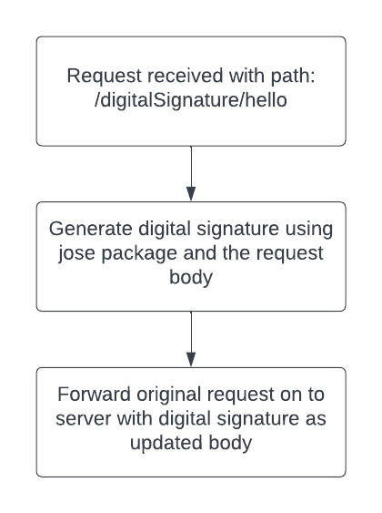

# Unicorn Finance server (the "++ real" proxy)

An express server (`http-proxy-middleware`) that proxies the frontend's requests to the
real J.P. Morgan APIs, adding the TLS client certificate and, for payments, a signed JWT.

**You only need this for Tier 2 (real / CAT).** The offline demo runs entirely in the
browser via MSW - no server, no certificates. See the root `README.md`.

## Routing

`app.js` picks the upstream from the request path (`routeRequest`):

- path contains `payment` → `https://api-sandbox.payments.jpmorgan.com`
- path contains `tsapi` (validations, transactions) → `https://apigatewaycat.jpmorgan.com`
- everything else → the gateway (default)

Handlers: `/mockapi/*` (JPMC Mock tier - mints an OAuth2 client-credentials Bearer token
and proxies to `api-mock.payments.jpmorgan.com`, no certs), `/digitalSignature/*` (CAT
payments - the body is signed with `jose` and sent as the JWT), and a catch-all `/*` for
the rest of CAT.



## Running it locally

You need a J.P. Morgan client certificate (onboard at developer.payments.jpmorgan.com and
ask your technical implementation manager). Then:

1. Put your certs in `../certs` (gitignored): `jpmc.key`, `jpmc.crt`,
   `digital-signature/key.key`.
2. Start the proxy on `:8082`:

   ```sh
   cd app/server
   pnpm install
   pnpm start:local
   ```

3. Run the client (`cd app/client && pnpm start`) and flip the UI switch to **CAT** - the
   client's `/cat-api` calls proxy to this server.

Or run it in a container as the `real` profile (mounts `./certs` at `/certs`):

```sh
docker compose --profile real up
```

## Deploying

Hosted on AWS Lambda + API Gateway; certs come from AWS Secrets Manager (`SECRET_NAME`,
fields `KEY`/`CERT`/`DIGITAL`) when `NODE_ENV` is not `development`. Build the artifact
with `pnpm build` (or `lambda-deployment/build-lambda.sh`). Full steps: `DEPLOYMENT_GUIDE.md`.
